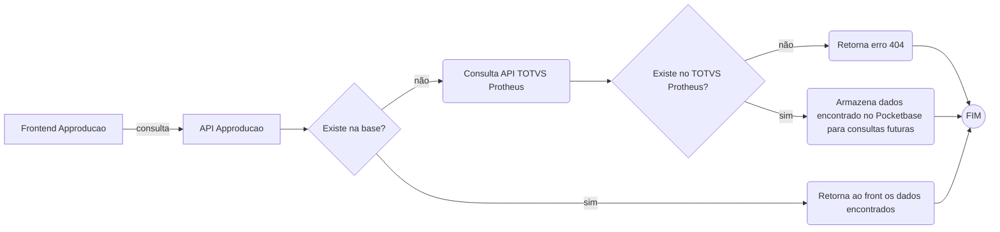

# API Approducao

API contruída com [express](https://expressjs.com/pt-br/) para ser a ligação entre um SPA e um Backend utilizando [Pocketbase](https://pocketbase.io/).

# Fluxo

Ao ser consultado uma ordem de produção via query params o express se encarregará de consultar no Pocketbase se a mesma esta cadastrada, retornando as informações necessárias, caso não encontre irá se comunicar com uma outra API por meio do [Axios](https://axios-http.com/ptbr/docs/intro). Sendo esta do ERP [TOTVS Protheus](https://www.totvs.com/), consultando se as informações existem e caso sim, as registrando no pocketbase para consultas futuras, trazendo mais agilidade e garantia das informações.

